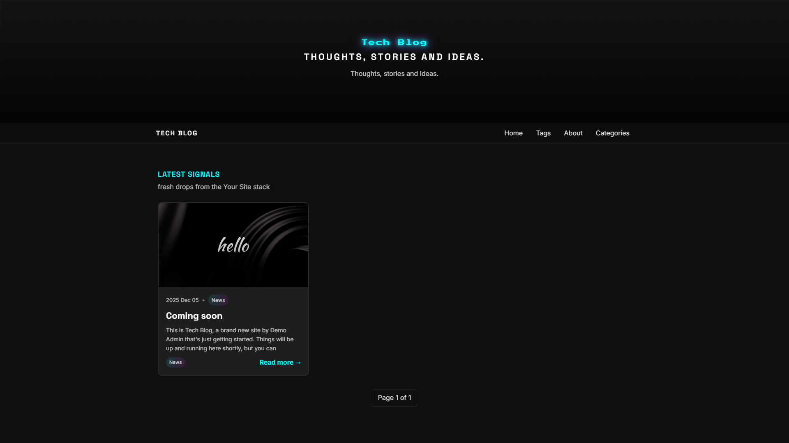
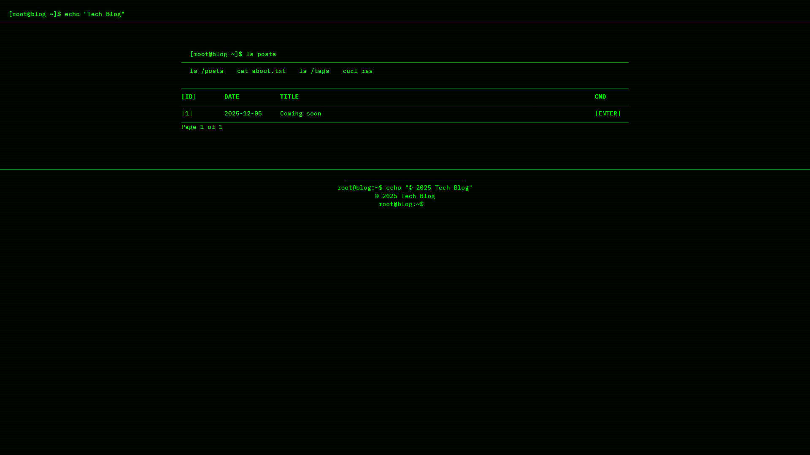
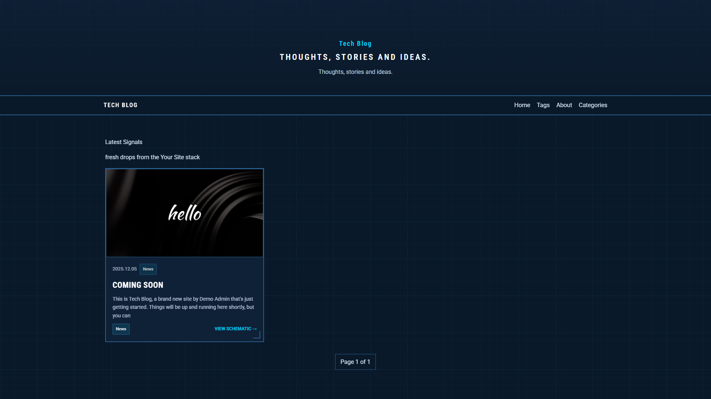
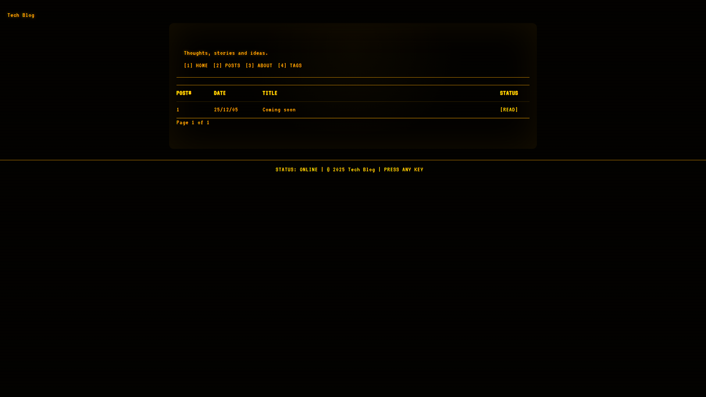
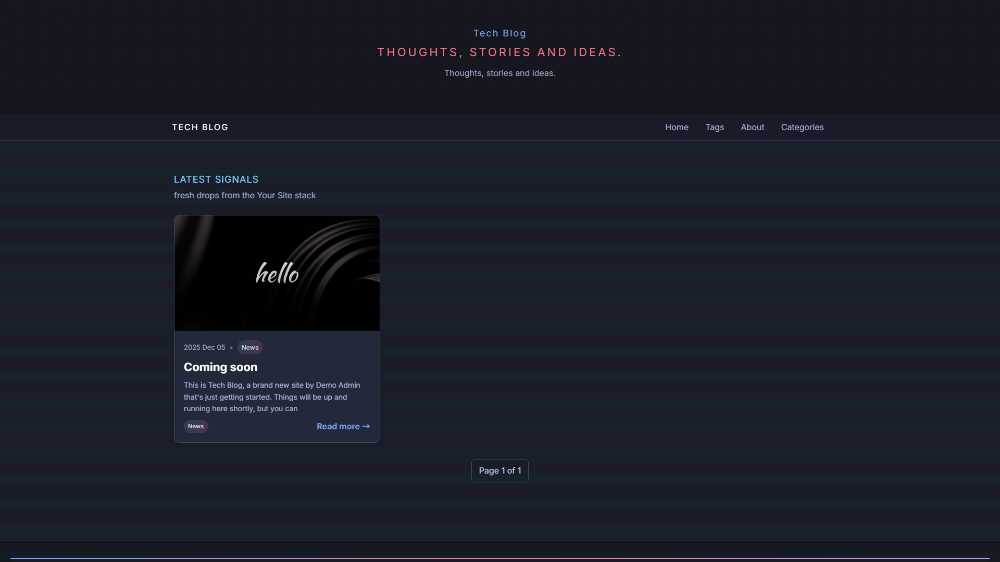

# Ghost Themes Collection

A collection of modern, dark-mode Ghost themes designed for tech blogs, developer portfolios, and cybersecurity content.

## Themes

### Neon Grid


Cyberpunk-inspired theme with neon accents and grid layouts. Features glowing borders, pixel-style typography, and a futuristic aesthetic.

**[See it live](https://rain-city.tech/blog/)**

---

### Arctic Minimal


Clean, minimal dark theme with icy blue accents. Focuses on readability with generous whitespace and subtle animations.

---

### Hacker Terminal


Terminal/console-inspired theme with monospace fonts and green-on-black styling. Perfect for security blogs and developer journals.

---

### Industrial Blueprint


Technical blueprint aesthetic with grid lines and industrial typography. Great for engineering and infrastructure content.

---

### Retro Amber


Classic amber-on-black terminal look reminiscent of vintage CRT monitors. Nostalgic yet modern.

---

### Tokyo Night


Inspired by the popular Tokyo Night color scheme. Purple and blue gradients with excellent code syntax highlighting support.

---

## Installation

1. Download the theme folder you want (e.g., `neon-grid`)
2. Zip the folder
3. In Ghost Admin, go to **Settings → Design → Change theme**
4. Click **Upload theme** and select your zip file
5. Activate the theme

## Requirements

- Ghost 5.0 or higher
- All themes are self-contained with no external dependencies

## Customization

Each theme uses CSS custom properties for easy customization. Edit the `assets/css/global.css` file to modify:

- Color palette
- Typography
- Spacing
- Animation timing

## Structure

```
theme-name/
├── assets/
│   ├── css/
│   │   ├── global.css      # Main styles & variables
│   │   ├── components.css  # UI components
│   │   └── layout.css      # Grid & layout
│   └── js/
│       └── main.js         # Optional interactivity
├── partials/
│   ├── header.hbs
│   ├── footer.hbs
│   └── post-card.hbs
├── default.hbs             # Base template
├── index.hbs               # Homepage
├── post.hbs                # Single post
├── page.hbs                # Static pages
├── tag.hbs                 # Tag archives
├── author.hbs              # Author pages
└── package.json            # Theme metadata
```

## License

MIT License - feel free to use, modify, and distribute.
---
Themes developed for [blog.rain-city.tech](https://blog.rain-city.tech)
